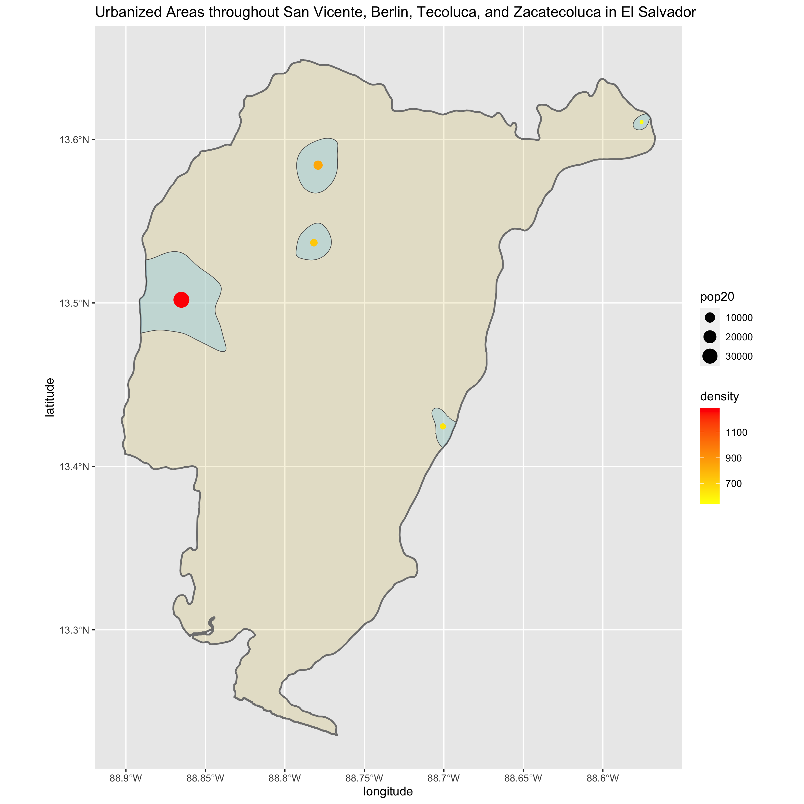
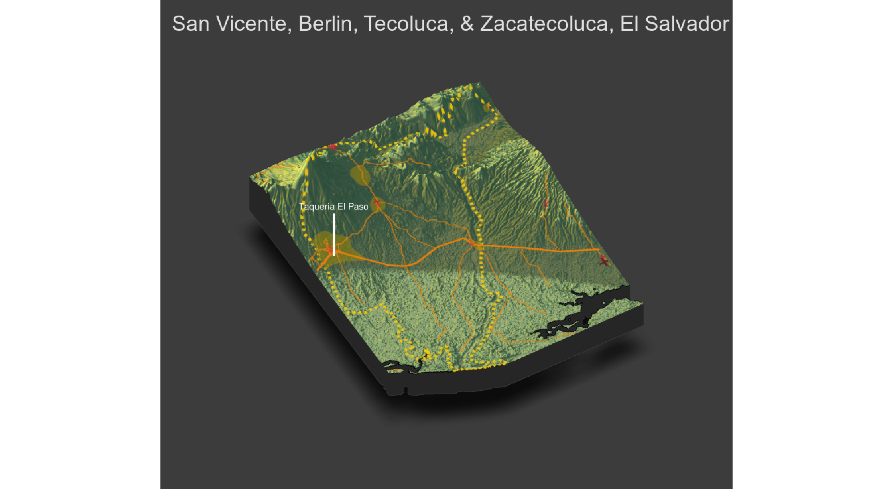

# Final Project

Accessibility 1 (Team Challenge Question):  De facto boundaries of human settlements and urbanization of El Salvador adm2 subdivisions

Accessbility 2 (Individual Deliverable): 
The total population of the adm2 subdivisions I've selected (San Vicente, Berlin, Tecoluca, and Zacatecoluca) is 156,894 people with 199888 grid cells. The size of the most densely populated human settlement is on the leftmost side residing in Zacatecoluca with 34360 people and a population density of 1288.9468. The lower middle settlement has a size of 3352 people and density of 735 people per area while the upper middle settlement has 6903 people with a pop20 density of 840.3808. The human settlement in the north of San Vicente has a pop20 value of 463 and density of 538.8029. Lastly, the most southern settlement has a population of 1607 and 637.2670 people per area. The primary highway (train tracks) connects two urban areas from east to west while the secondary and tertiary roadways (highways and paths) connect the rest of the settlements, excluding the settlement on the northern region of San Vicente. The health care facilities are found on three out of five of the major urban areas, showing how service accessibility is not common in these populated regions. There are 5 clinics, 6 pharmacies, and 2 other healthcare facilities spatially distributed throughout these adm2 subdivisions.

Accesbility 3 (Team and Individual Deliverable):
The topography of El Salvador consists of dormant volacanos and mainly mountainous regions with central plateaus and plains. The urban areas and human settlements are found near the low altitudes of the mountains such as Volcán de San Vicente. The primary transportation facility is found on the central plateaus while the various secondary and tertiary roadways are spatially distributed throughout the mountains and flat lands. The topography impacted the healthcare facilities in a similar way, where hospitals and clinics are dispersed throughout the densley populated human settlements. Producing the 3D plot did make me interpret the spatial distribution in a different way from my previous analysis because I thought the transportation and healthcare facilities would be built around the volcano and mountains. 

