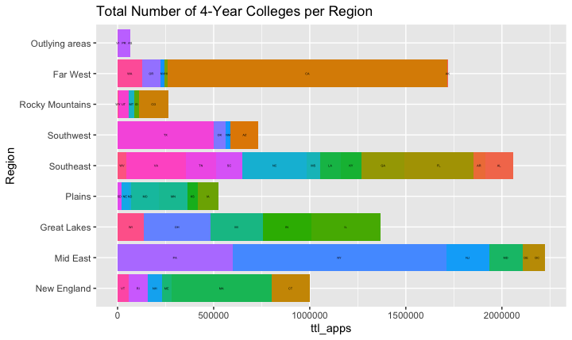
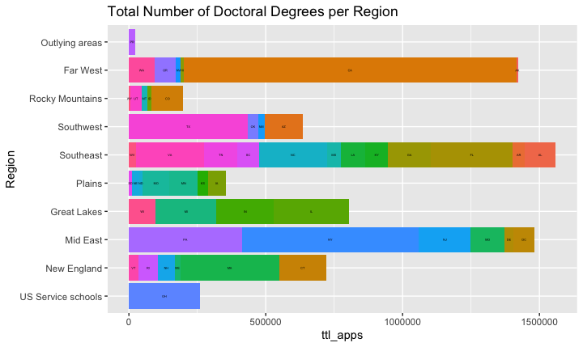

# Project 1

This is my plot for the first part of Project 1. The data of the first graph is the total number of applications received by universities offering a four-year or higher degree. The data was obtained from the National Center for Education Statistics.

These are my plots for the second part of Project 1. The data of the second graph is the total number of applications received by universities offering doctoral degrees.

