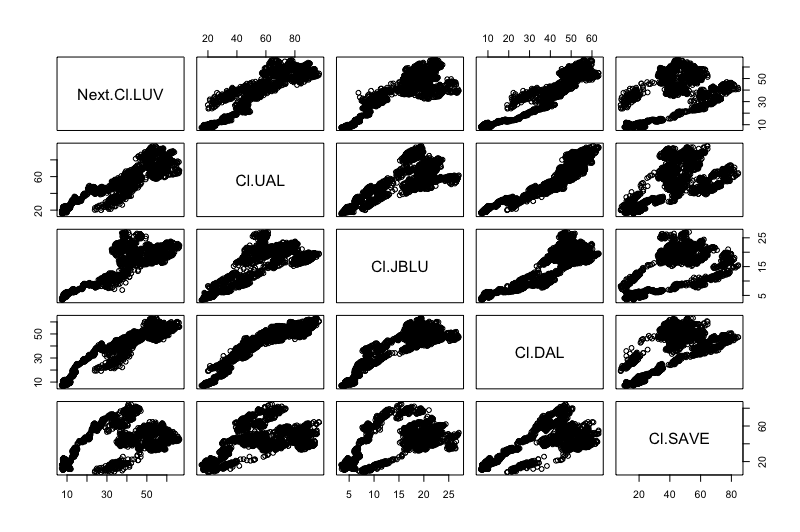
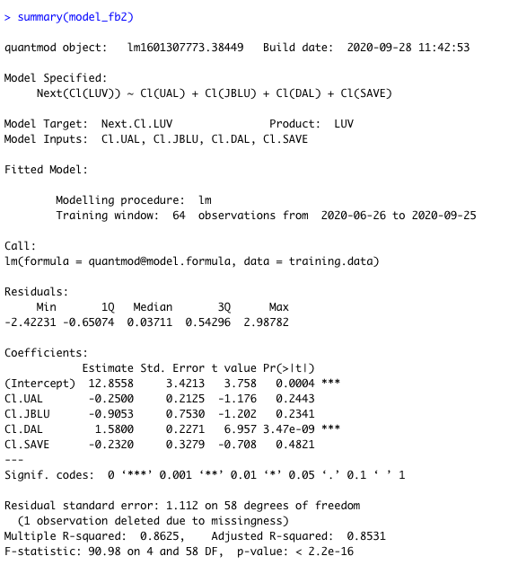

# Project 2

I used Southwest(LUV) as my predicted stock and United Airlines Holdings(UAL), Jet Blue(JBLU), Delta(DAL), and Spirit(SAVE) as predictors. The matrix shows a positive, linear relationship between the closing prices of United Airlines Holdings, Jet Blue, Delta, and Spirit today and the predicted closing price of Southwest tomorrow.  

This is the summary of my statistical model:

