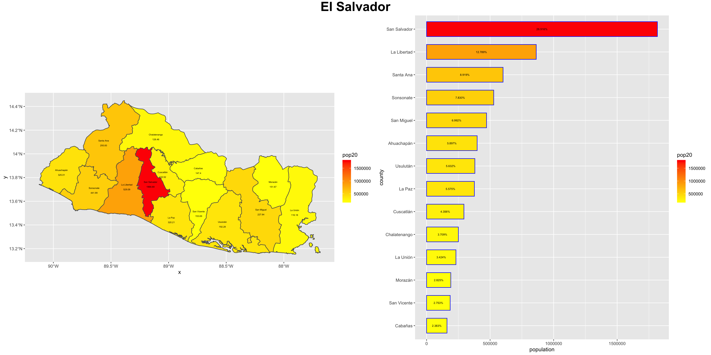

# Project 3

I plotted the administrative boundaries of El Salvador using its local, district, and regional subdivisions from GADM.
The national boundary (SLV_0), first level administrative subdivisions (SLV_1) and second level administrative subdivisions (SLV_2) were obtained. El Salvador has a population of about 6.5 million. 

I created a larger map of El Salvador with rectangles identifying areas of detailed maps, showing its subdivisions. Detail A is a subplot of San Salvador, a high densely populated city in El Salvador. San Salvador is also the capital of El Salvador. Detail B shows the subdivisions of Morazán, a less populated region of El Salvador. 

