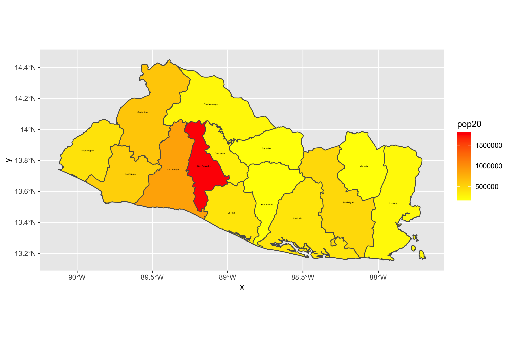
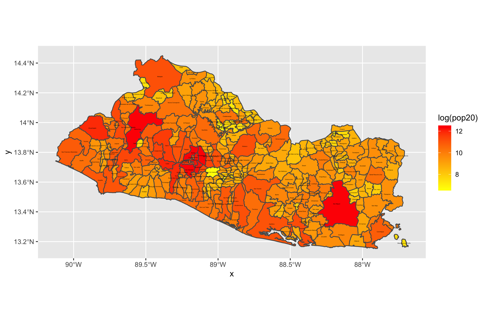
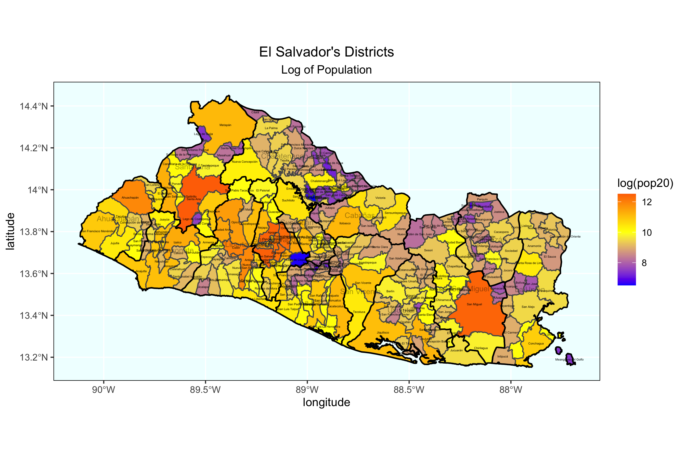
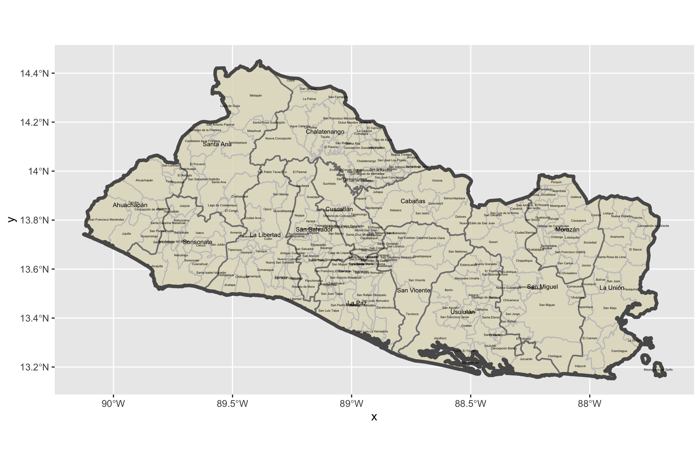
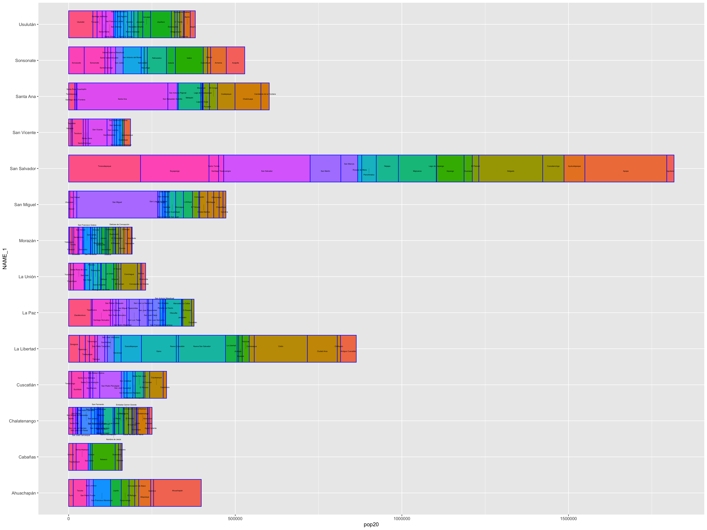

# Project 4

Challenge Question: 
I chose El Salvador for my LMIC country. This plot shows the continuous values of population totals for each of El Salvador's adm1 subdivisions. 

Stretch Goal 1: 
This plot shows the values of population in each of El Salvador's adm2 subdivsions. 

Stretch Goal 2:
I added both subdivision boundaries of counties (adm1) and districts (adm2) in for this plot of El Salvador. 

Individual Deliverable:
I created a geometric bar plot using the first level administrative subdivisions of my LMIC, El Salvador. The spatial plot to the left describes the population and density in persons per km^2. The bar plot to the right describes the population and share of population in %. I produced the bar plot by creating area and density columns with the mutate() command. To generate the plot, I used the geom_bar() command and ordered the counties from largest to smallest using fct_reorder(). I used the spatial plot's lines of code from Stretch Goal 1 and added the density values. One modification I had to make was adjusting the text describing density under the labels of my spatial plot. I used  nudge_y =-.04 to adjust this so that the density appeared directly beneath the county labels. From these plots, San Salvador is observed to have a significantly higher population density than the other counties. 

Individual Stretch Goal 1: 
In this deliverable, I used the adm2 class object (districts) instead of adm1 with the combined spatial description and geometric bar plot from my individual deliverable for this geometric bar plot. 

