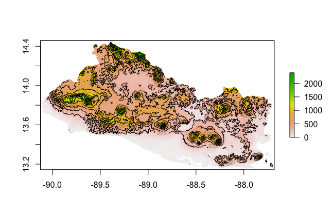

# Project 5

Plots of RasterStack Layers:

First Combined Histogram with Density Plot:
This plot shows the coorelationship between the log(pop20) and adm2 population density. The peak of the curve is in the center, in the 8-10 bin.

Second Combined Histogram with Density Plot:
This plot shows the coorelationship between the predictor, nighttime lights layer, and the response, adm2 population density. The data set is skewed to the left with the maximum frequency of distribution on the left. 

