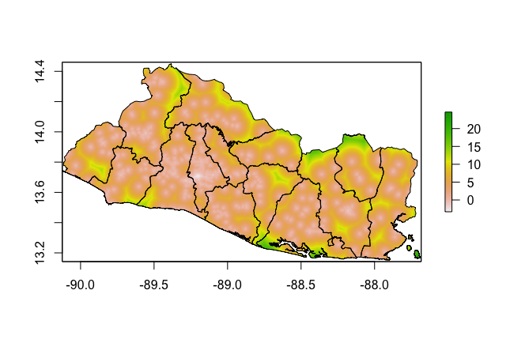
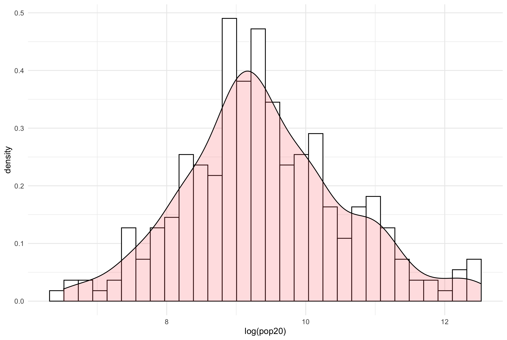
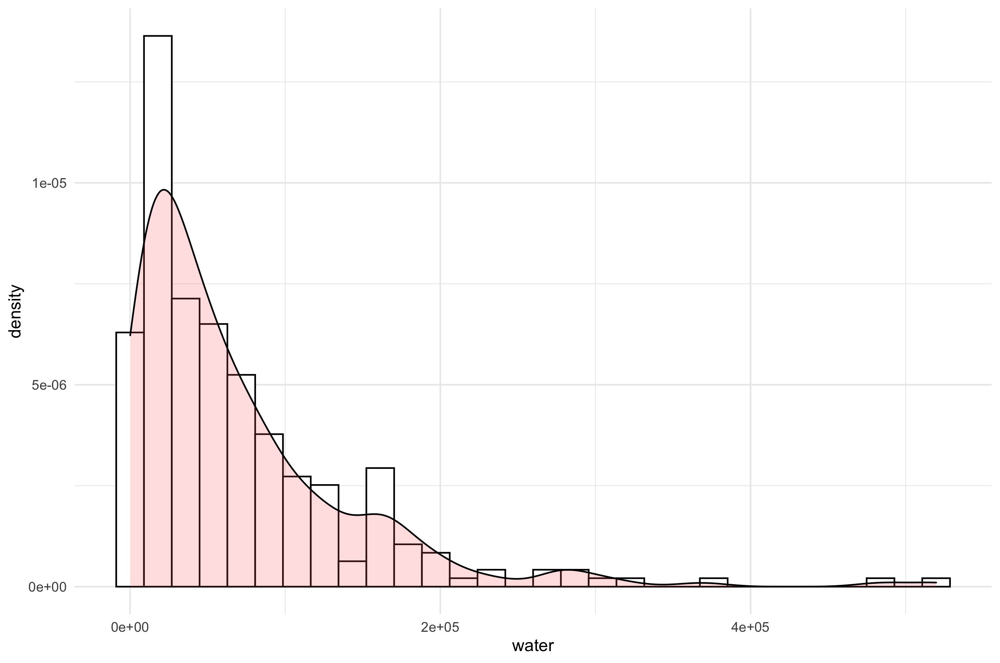

# Project 5

Plots of RasterStack Layers:

1st Combined Histogram with Density Plot:
This plot shows the coorelationship between the log(pop20) and adm2 population density. The peak of the curve is in the center, in the 8-10 bin.

2nd Combined Histogram with Density Plot:
This plot shows the coorelationship between the predictor, nighttime lights, and the response, adm2 population density. The dataset is skewed to the left with the maximum frequency of distribution on the left. 

3rd Combined Histogram with Density Plot:
This plot shows another coorelationship of how topography affects the population density. 

